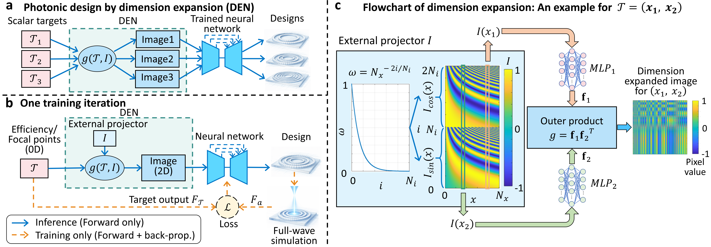

# Dimension expansion for simulation-efficient nanophotonic neural networks

<p align="center">
  
</p>

<p align="center">
<b>Figure 1.</b> Overview of the proposed Dimension Expansion Network (DEN) framework.
</p>

## Description

This repository implements a **Dimension Expansion Network (DEN)** for inverse metalens design.

Given a target focal position, the DEN expands the low-dimensional target into a two-dimensional representation, which is processed by a U-Net to generate a metalens structure. The generated structure is evaluated using full-wave electromagnetic simulations, and the resulting figure of merit (FoM) is used for gradient-based optimization.

## Files

| File | Description |
|--------|--------|
| `trainmetalens80by80.py` | Training script |
| `test.py` | Evaluation and visualization script |
| `unet.py` | U-Net architecture and DEN implementation |
| `loss.py` | Electromagnetic simulation and FoM computation |
| `utils.py` | Utility functions |
| `Figure_proposed_method.png` | Overview of the proposed method |

## Requirements

- Python 3.10+
- PyTorch
- NumPy
- SciPy
- Matplotlib
- OpenCV
- Seaborn

Install dependencies:

```bash
pip install torch numpy scipy matplotlib opencv-python seaborn
```

## Training

```bash
python trainmetalens80by80.py
```

## Trained model after 8,300 iterations

A pretrained model after **8,300 training iterations** can be downloaded from:

https://github.com/huangshuo343/dimension_expansion_network/releases

## Evaluation

```bash
python test.py
```

The evaluation script loads a pretrained model and generates metalens designs, field distributions, focal efficiencies, and visualization results.

## Citation

If you use this code in your research, please cite:

```bibtex
@article{huang2025den,
  title={Photonic Design by Dimension Expansion Network},
  author={Huang, Shuo and collaborators},
  year={2025}
}
```

## Contact

Shuo Huang: shuohuan@usc.edu
University of Southern California (USC)
